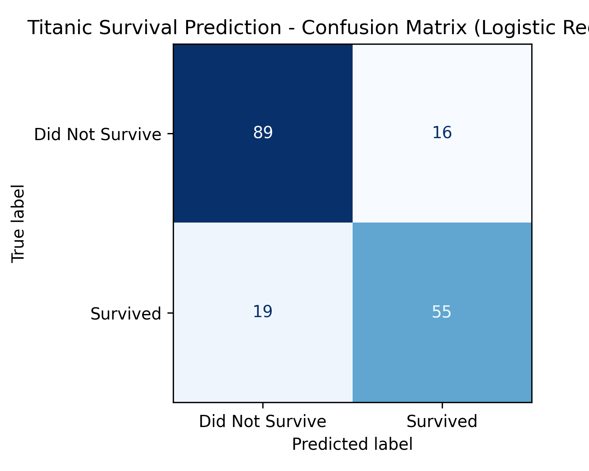
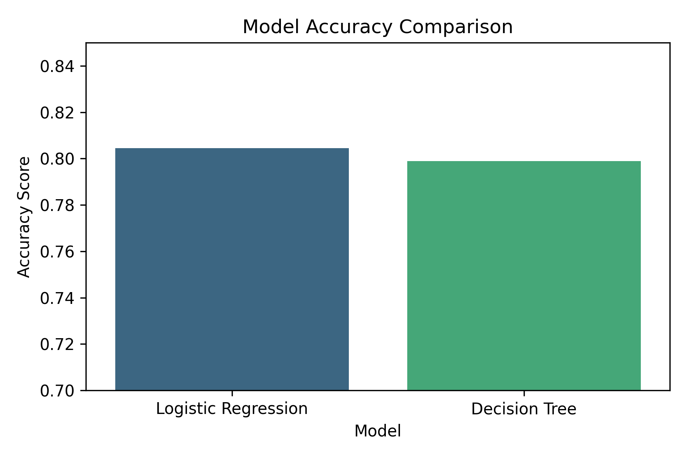
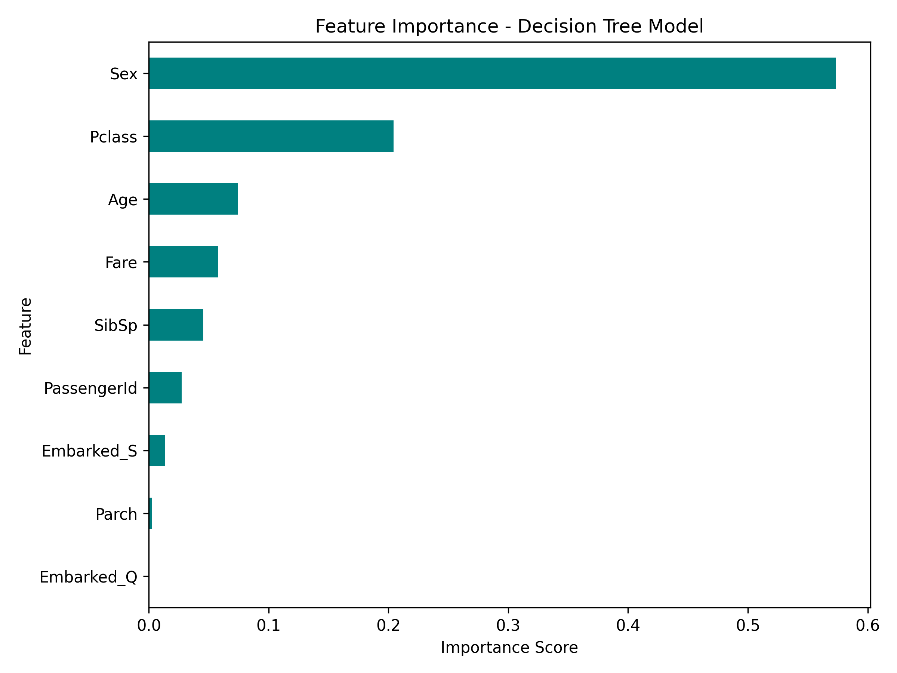
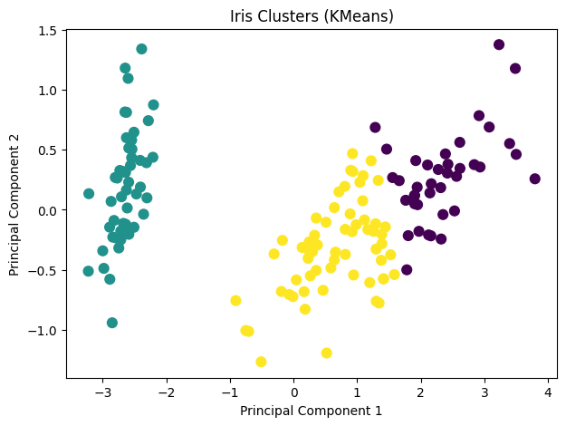

# Machine Learning Fundamentals — Supervised and Unsupervised Learning

## Project Overview
This repository demonstrates the practical implementation of **core Machine Learning fundamentals** using **Scikit-learn**.  
It includes two mini-projects designed to build strong foundational intuition:

1. **Titanic Survival Prediction (Supervised Learning)** — A classification task to predict passenger survival.  
2. **Iris Clustering Visualization (Unsupervised Learning)** — A clustering task to visualize species grouping.

The projects emphasize **hands-on learning**, focusing on feature preprocessing, model training, and performance evaluation.

---

## Folder Structure

`````

ml_fundamentals-project/
│
├── data/
│   │   └── titanic.csv
│   │
│   │
│   │ 
├── images/
│   │   ├── titanic_confusion_matrix.png
│   │   ├── feature_importance.png
│   │   ├── accuracy_comparison.png
│   │   └── iris_clusters.png
│   │ 
├── notebooks/
│   │   ├── Titanic_ML_Model.ipynb
│   │   └── Iris_Clustering.ipynb 
├── README.md

`````
---

## Project 1 — Titanic Survival Prediction (Supervised Learning)

### Objective
Predict whether a passenger survived the Titanic disaster using demographic and ticket features.

---

### Dataset Description
**Source:** [Kaggle – Titanic Dataset](https://www.kaggle.com/competitions/titanic/data)

| Column | Description |
|--------|-------------|
| `Survived` | Target variable (1 = Survived, 0 = Did not survive) |
| `Pclass` | Passenger class (1st, 2nd, 3rd) |
| `Sex` | Gender of passenger |
| `Age` | Age of passenger |
| `SibSp` | Number of siblings/spouses aboard |
| `Parch` | Number of parents/children aboard |
| `Fare` | Ticket price |
| `Embarked` | Port of embarkation (C, Q, S) |

---

### Key Preprocessing Steps

#### 1. Handle Missing Values
Filled missing `Age` values with the median and `Embarked` with the most frequent category.
````python
df['Age'].fillna(df['Age'].median(), inplace=True)
df['Embarked'].fillna(df['Embarked'].mode()[0], inplace=True)
`````

#### 2. Drop Irrelevant Columns

Removed columns that did not contribute meaningful information.

`````python
df.drop(['Cabin', 'Name', 'Ticket'], axis=1, inplace=True)
`````


#### 3. Encode Categorical Variables

Converted categorical data into numeric form using LabelEncoder and OneHotEncoder.

`````python
label_encoder = LabelEncoder()
df['Sex'] = label_encoder.fit_transform(df['Sex'])
df = pd.get_dummies(df, columns=['Embarked'], drop_first=True)
`````

#### 4. Scale Features and Split Data

Standardized numerical columns for balanced model learning.

`````python
X_train, X_test, y_train, y_test = train_test_split(X, y, test_size=0.2, random_state=42)
scaler = StandardScaler()
X_train = scaler.fit_transform(X_train)
X_test = scaler.transform(X_test)
`````

---

### Models Implemented

#### Logistic Regression

`````python
log_model = LogisticRegression()
log_model.fit(X_train, y_train)
y_pred_log = log_model.predict(X_test)
`````

**Accuracy:** `0.804`
**Confusion Matrix:**

`````
[[89 16]
 [19 55]]
`````

**Classification Report Summary:**

* Precision: 0.80
* Recall: 0.80
* F1-score: 0.80

**Insight:**
Logistic Regression performs robustly, identifying most survivors correctly, with an overall balanced recall and precision.

**Visualization Placeholder:**


---

#### Decision Tree Classifier

`````python
tree_model = DecisionTreeClassifier(max_depth=4, random_state=42)
tree_model.fit(X_train, y_train)
y_pred_tree = tree_model.predict(X_test)
`````

**Accuracy:** `0.798`
**Confusion Matrix:**

`````
[[96  9]
 [27 47]]
`````

**Classification Report Summary:**

* Precision: 0.80
* Recall: 0.77
* F1-score: 0.79

**Insight:**
Decision Tree achieved similar accuracy but showed a tendency to overfit slightly. It classified non-survivors more confidently but missed a few survivors compared to Logistic Regression.

**Visualization Placeholder:**


---

### Model Comparison

| Model               | Accuracy | Strength                                                | Limitation              |
| ------------------- | -------- | ------------------------------------------------------- | ----------------------- |
| Logistic Regression | 0.804    | Simple, interpretable, well-balanced results            | Assumes linearity       |
| Decision Tree       | 0.799    | Captures non-linear relations, feature interpretability | Slight overfitting risk |

---

### Key Insights

* Survival probability was higher for **female passengers**, **younger individuals**, and **1st class travelers**.
* **Fare** and **Embarked (C)** had noticeable influence on survival.
* Logistic Regression offered slightly better generalization on test data.

**Visualization Placeholder:**


---

### Output File

`````
notebooks/Titanic_ML_Model.ipynb
`````

---

## Project 2 — Iris Clustering Visualization (Unsupervised Learning)

### Objective

Cluster the famous Iris dataset into natural groups using **KMeans**, and visualize separation using **Principal Component Analysis (PCA)**.

---

### Dataset Description

**Source:** Scikit-learn built-in Iris dataset

| Column              | Description                |
| ------------------- | -------------------------- |
| `sepal length (cm)` | Sepal length of the flower |
| `sepal width (cm)`  | Sepal width of the flower  |
| `petal length (cm)` | Petal length of the flower |
| `petal width (cm)`  | Petal width of the flower  |

**Target Classes:**

* 0 → Setosa
* 1 → Versicolor
* 2 → Virginica

---

### Implementation Details

#### 1. Load Data and Initialize KMeans

```python
from sklearn.datasets import load_iris
from sklearn.cluster import KMeans

iris = load_iris()
X = iris.data
kmeans = KMeans(n_clusters=3, random_state=42)
kmeans.fit(X)

```

#### 2. Dimensionality Reduction with PCA

```python

from sklearn.decomposition import PCA

pca = PCA(n_components=2)
pca_data = pca.fit_transform(X)

```

#### 3. Cluster Visualization

```
plt.scatter(pca_data[:,0], pca_data[:,1], c=kmeans.labels_, cmap='viridis', s=60)
plt.title('Iris Clusters (KMeans)')
plt.xlabel('Principal Component 1')
plt.ylabel('Principal Component 2')

```

**Visualization Placeholder:**


---

### Evaluation

```python
from sklearn.metrics import adjusted_rand_score
print("Adjusted Rand Index:", adjusted_rand_score(iris.target, kmeans.labels_))
```

**Adjusted Rand Index (ARI):** `0.716`

**Insight:**

* The clustering successfully identified distinct **Setosa** species.
* Some overlap between **Versicolor** and **Virginica** occurs due to feature similarity.
* An ARI of 0.716 indicates a strong alignment between unsupervised clusters and true species labels.

---

### Key Takeaways

* **KMeans** efficiently grouped Iris samples based on petal and sepal features.
* **PCA** allowed intuitive visualization of high-dimensional relationships.
* Demonstrates how **unsupervised learning** can uncover natural structures in data without labeled targets.

---

## Tools and Libraries

* Python 3.x
* Pandas, NumPy
* Scikit-learn
* Matplotlib, Seaborn

---

## Summary of Outputs

| Project          | Learning Type | Model(s) Used                      | Accuracy / ARI | Output Notebook          |
| ---------------- | ------------- | ---------------------------------- | -------------- | ------------------------ |
| Titanic Survival | Supervised    | Logistic Regression, Decision Tree | 0.804 / 0.799  | `Titanic_ML_Model.ipynb` |
| Iris Clustering  | Unsupervised  | KMeans                             | ARI = 0.716    | `Iris_Clustering.ipynb`  |

---

## Next Steps

* Enhance the Titanic model using **Random Forest** or **XGBoost**.
* Apply **Silhouette Score** and **Elbow Method** to validate optimal cluster count for Iris.
* Convert both projects into interactive dashboards using **Streamlit or Plotly Dash**.

---

* **Author:** Yash Desai
* **Email:** desaisyash1000@gmail.com 
* **GitHub:** yashdesai023


