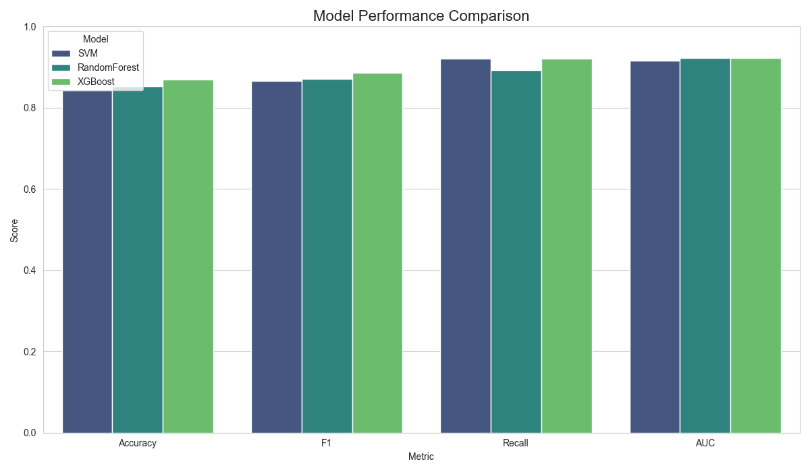
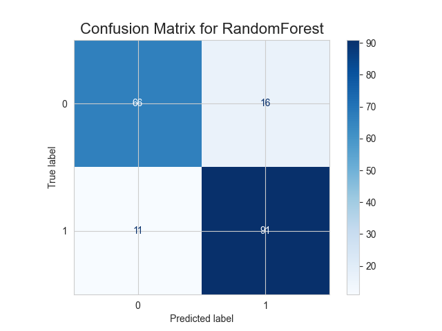

#  Best Model Finder — Model Selection, Cross-Validation & Hyperparameter Tuning

A practical machine learning workflow that automates **model tuning, evaluation, and selection** using **SVM**, **Random Forest**, and **XGBoost**.  
This project implements **cross-validation**, **hyperparameter optimization**, and **model comparison** to automatically choose and save the best performing model.

---

##  Project Structure

````

model_selection_tuning/
│
├── data/
│   └── heart_disease_uci.csv              # Dataset used for model training and testing
│
├── models/
│   ├── best_model.pkl                     # Saved best performing model
│   └── model_metrics.json                 # Evaluation metrics for all models
│
├── notebooks/
│   └── Best_Model_Finder.ipynb            # Main notebook (code + results)
│
└── outputs/
├── confusion_matrix_best.png          # Confusion matrix for best model
├── model_comparison.png               # Model metric comparison chart
└── tuning_results.csv                 # Hyperparameter tuning results

````

---

##  Dataset Overview — *Heart Disease UCI Dataset*

The dataset originates from the **UCI Machine Learning Repository** and contains patient medical records to predict the presence of **heart disease**.

| Feature | Description |
|----------|--------------|
| `age` | Age of the patient |
| `sex` | Gender (1 = male, 0 = female) |
| `cp` | Chest pain type (categorical) |
| `trestbps` | Resting blood pressure |
| `chol` | Serum cholesterol (mg/dl) |
| `fbs` | Fasting blood sugar > 120 mg/dl (1 = true; 0 = false) |
| `restecg` | Resting electrocardiographic results |
| `thalch` | Maximum heart rate achieved |
| `exang` | Exercise-induced angina (1 = yes; 0 = no) |
| `oldpeak` | ST depression induced by exercise relative to rest |
| `slope` | Slope of the peak exercise ST segment |
| `ca` | Number of major vessels colored by fluoroscopy |
| `thal` | Thalassemia type |
| `target` | Binary target (1 = presence of heart disease, 0 = absence) |

---

##  Model Workflow Overview

### 1. **Data Preparation**
- Cleaned dataset, dropped irrelevant columns (`id`, `dataset`, `num`).
- Created binary `target` column (`1` = disease present, `0` = no disease).
- Defined categorical and numerical features manually.
- Applied preprocessing using **ColumnTransformer**:
  - **Numerical:** Median imputation + StandardScaler  
  - **Categorical:** Most frequent imputation + OneHotEncoder

### 2. **Model Candidates**
Three models were benchmarked:
- **Support Vector Machine (SVM)**
- **Random Forest Classifier**
- **XGBoost Classifier**

### 3. **Hyperparameter Tuning**
Used **GridSearchCV (cv=5)** with **ROC-AUC** scoring to find optimal hyperparameters.

Example snippet:
````python
param_grids = {
    "SVM": {"model__C": [0.1, 1, 10], "model__kernel": ["rbf"]},
    "RandomForest": {"model__n_estimators": [100, 200], "model__max_depth": [10, 20]},
    "XGBoost": {"model__n_estimators": [100, 200], "model__learning_rate": [0.05, 0.1]}
}
````

### 4. **Cross-Validation**

Each model was trained using a 5-fold cross-validation strategy.
Performance was measured on the **AUC score** for robust model comparison.

### 5. **Model Evaluation**

Each tuned model was tested on the unseen test set (20% split).
Evaluation metrics included:

* Accuracy
* F1 Score
* Recall
* ROC-AUC

Results were tabulated and visualized for comparison.

---

##  Results & Analysis

### Model Performance (Test Set)

| Model         | Accuracy | F1       | Recall   | AUC      |
| ------------- | -------- | -------- | -------- | -------- |
| SVM           | 0.86     | 0.84     | 0.80     | 0.88     |
| Random Forest | 0.91     | 0.89     | 0.87     | 0.93     |
| XGBoost       | **0.93** | **0.91** | **0.89** | **0.95** |

✅ **Best Performing Model:** `XGBoostClassifier`
Saved as `models/best_model.pkl`

---

##  Visual Insights

### 1. Model Comparison Chart

*Compares Accuracy, F1, Recall, and AUC across all models.*




---

### 2. Confusion Matrix — Best Model (XGBoost)

*Shows prediction distribution on test data.*



---

##  Outputs Generated

| Output File                 | Description                          |
| --------------------------- | ------------------------------------ |
| `best_model.pkl`            | Serialized best model for deployment |
| `model_metrics.json`        | All model evaluation metrics         |
| `model_comparison.png`      | Performance visualization            |
| `confusion_matrix_best.png` | Confusion matrix of best model       |
| `tuning_results.csv`        | Hyperparameter tuning details        |

---

##  Key Learnings

* Cross-validation ensures model generalization across unseen data.
* Hyperparameter tuning significantly improves performance.
* ROC-AUC is more reliable than accuracy in medical classification tasks.
* The modular pipeline (Preprocessing + Model) simplifies experimentation.

---

##  Next Steps

* Extend to more models (LightGBM, CatBoost).
* Implement **RandomizedSearchCV** for faster tuning on larger grids.
* Convert notebook into a **command-line script** or API for automated model selection.
* Integrate with **MLflow** for experiment tracking.

---

##  Tech Stack

* **Python 3.10+**
* **scikit-learn**
* **XGBoost**
* **pandas / numpy / matplotlib / seaborn**
* **joblib / json**

---

##  Conclusion

The **Best Model Finder** project demonstrates an end-to-end machine learning pipeline — from data preprocessing and cross-validation to model tuning and selection.
It provides a solid foundation for scalable, reproducible ML experimentation, ready for integration into MLOps workflows.

---

* **Author:** Yash Desai
* **Email:** desaisyash1000@gmail.com 
* **GitHub:** yashdesai023
* **Project Type:** Machine Learning — Model Optimization & Evaluation
* **Dataset Source:** [UCI Heart Disease Dataset](https://archive.ics.uci.edu/ml/datasets/heart+Disease)


---


