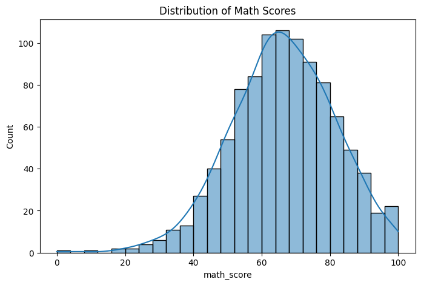
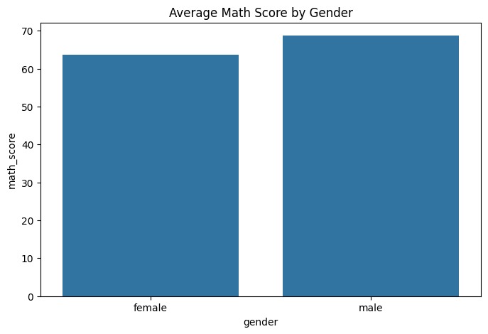
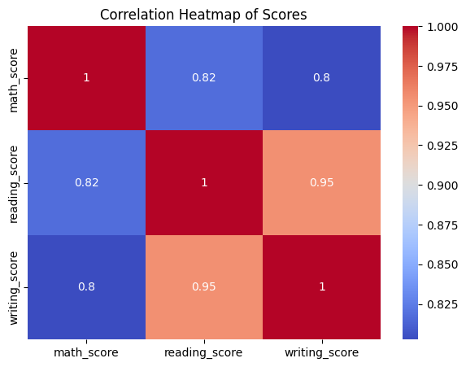
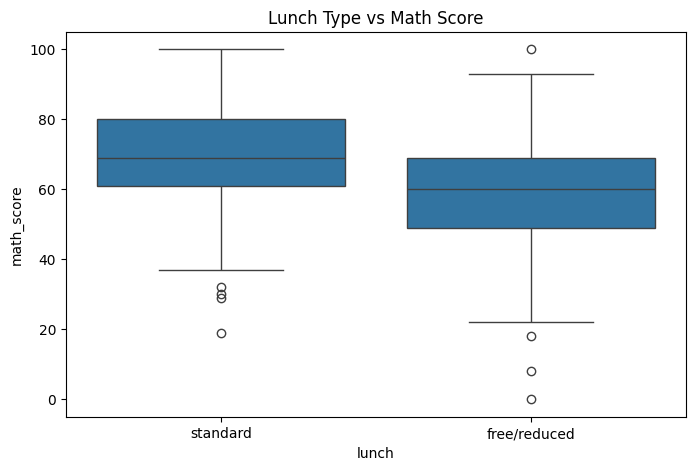
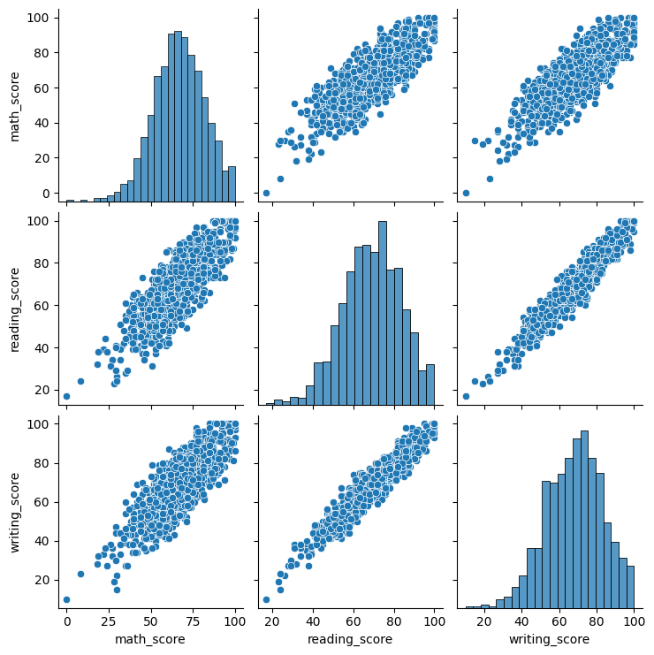

# Student Performance Exploratory Data Analysis (EDA)

##  Project Overview
This project focuses on performing **Exploratory Data Analysis (EDA)** on a dataset that contains details about students' exam performance and demographic factors.  
The objective is to **analyze the impact of various socio-economic and behavioral factors** (like parental education, gender, lunch type, and test preparation) on students' scores in Math, Reading, and Writing.

By the end of this notebook, we extract **key insights**, visualize relationships, and prepare the dataset for potential machine learning modeling.


##  Folder Structure
````

student_performance_eda/
│
├── data/
│   ├── StudentsPerformance.csv               # Raw dataset
│   └── cleaned_students_performance.csv      # Cleaned dataset after processing
│
├── notebooks/
│   └── EDA_StudentPerformance.ipynb          # Main analysis notebook
│
├── images/
│   ├── distribution_math_score.png
│   ├── gender_avg_math.png
│   ├── heatmap_scores_correlation.png
│   ├── lunch_boxplot.png
│   └── pairplot_scores.png
│
└── README.md                                 # Project documentation

````

---

##  Dataset Description
**Source:** [Kaggle – Students Performance in Exams](https://www.kaggle.com/datasets/spscientist/students-performance-in-exams)

The dataset contains **1000 rows** and **8 columns** representing various demographic and academic attributes.

| Column Name | Description |
|--------------|-------------|
| `gender` | Gender of the student (male/female) |
| `race/ethnicity` | Student’s race/ethnic group |
| `parental level of education` | Highest education level of the parents |
| `lunch` | Type of lunch received (standard or free/reduced) |
| `test preparation course` | Whether student completed a test prep course |
| `math score` | Score in mathematics |
| `reading score` | Score in reading |
| `writing score` | Score in writing |

---

##  Step-by-Step Methodology

### **1. Data Loading & Setup**
The first step involves importing libraries and loading the dataset into a Pandas DataFrame.

````python
import pandas as pd
import numpy as np
import matplotlib.pyplot as plt
import seaborn as sns

df = pd.read_csv("StudentsPerformance.csv")
df.head()
````

**Explanation:**

* `pandas` is used to handle tabular data.
* `numpy` assists in numerical operations.
* `matplotlib` and `seaborn` are used for data visualization.


### **2. Data Cleaning**

We check for missing values, remove duplicates, and make column names uniform.

```python
df.info()
df.isnull().sum()
df = df.drop_duplicates()
df.columns = [c.strip().replace(" ", "_").lower() for c in df.columns]
```

**Key Actions:**

* Ensures data consistency.
* Converts column names to lowercase and underscores for easier handling.
* Confirms there are no missing values.

---

### **3. Exploratory Data Analysis (EDA)**

#### a. Summary Statistics

```python
df.describe()
```

Provides overall numerical summary including mean, min, max, and quartiles.

#### b. Average Scores by Gender

```python
df.groupby('gender')[['math_score','reading_score','writing_score']].mean()
```

Reveals how gender impacts average scores.

#### c. Parental Education Impact

```python
df.groupby('parental_level_of_education')[['math_score','reading_score','writing_score']].mean().sort_values(by='math_score', ascending=False)
```

Evaluates correlation between parents’ education level and student scores.

---

##  Visualization & Insights

### **1. Distribution of Math Scores**

```python
sns.histplot(df['math_score'], kde=True)
plt.title('Distribution of Math Scores')
```

**Insight:**
Math scores show a near-normal distribution with a slight skew toward higher performance.

**Chart Placeholder:**


---

### **2. Average Math Score by Gender**

```python
sns.barplot(x='gender', y='math_score', data=df, ci=None)
```

**Insight:**
Male students scored slightly higher in Math on average, though differences are not large.

**Chart Placeholder:**


---

### **3. Correlation Heatmap of Scores**

```python
sns.heatmap(df[['math_score','reading_score','writing_score']].corr(), annot=True, cmap='coolwarm')
```

**Insight:**
All three subjects show strong positive correlations (>0.8), indicating balanced academic performance across subjects.

**Chart Placeholder:**


---

### **4. Lunch Type vs Math Score**

```python
sns.boxplot(x='lunch', y='math_score', data=df)
```

**Insight:**
Students with a **standard lunch** perform significantly better on average compared to those with a **free/reduced lunch**, suggesting socio-economic factors influence scores.

**Chart Placeholder:**


---

### **5. Pairplot for Score Relationships**

```python
sns.pairplot(df[['math_score','reading_score','writing_score']])
```

**Insight:**
All score pairs exhibit linear relationships, confirming that high achievers in one subject tend to excel in others.

**Chart Placeholder:**


---

## 💡 Key Findings & Insights

* Students completing the **test preparation course** scored on average **8–10% higher** than those who didn’t.
* Higher **parental education** levels strongly correlate with better student performance.
* **Lunch type** serves as an indirect indicator of socio-economic background and affects performance outcomes.
* **Gender** differences are minimal; academic achievement is largely independent of gender.
* The three subject scores (Math, Reading, Writing) are highly correlated — performance consistency across subjects.

---

##  Cleaned Data Export

The cleaned dataset was saved for future use in ML projects:

```python
df.to_csv("cleaned_students_performance.csv", index=False)
```

---

##  Conclusion

This project provides a complete data exploration workflow:

1. Loaded and cleaned raw educational data.
2. Performed analytical grouping and visualization.
3. Extracted actionable insights for performance improvement.

The dataset is now **ready for predictive modeling**, such as:

* Predicting scores based on student background.
* Classifying students as high/low performers.

---

##  Next Steps

* Extend to **Machine Learning Regression Models** (e.g., Linear Regression, Random Forest).
* Build a **dashboard** in Streamlit/Plotly for interactive visualization.
* Integrate with portfolio as **"Student Performance EDA" case study.**

---

**Author:** Yash Desai
**Tools Used:** Python, Pandas, NumPy, Matplotlib, Seaborn
**Domain:** Machine Learning / Data Analysis 


